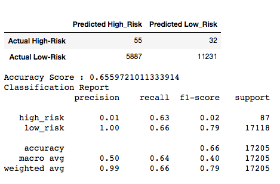
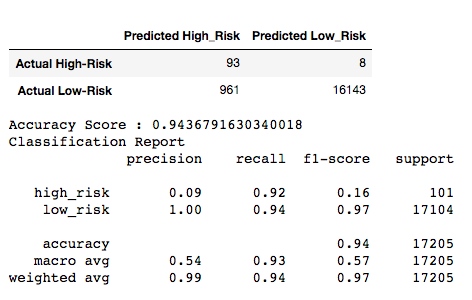

# Credit Risk Analysis

## Background
Jill, data scientist manager at LendingClub has asked you to create a predictive model to help create a model to predict credit risk for prospective clients for the peer-to-peer lending services company.  

As you know, credit risk is fundamentally an **unbalanced classification**, since the good loans far outweigh the bad.  To be thorough, you will employ multiple techniques to train and create a different models which will be assessed for their predictive strength.  Libraries such as  **imbalanced-learn** and **scikit-learn** will be used as well as various sampling techniques.

## Overview
The data will come directly from LendingClub, and categorical data will need to be transformed to numeric representations before sampling can occur.

The transformed data will be divided into training and testing groups and then sammpled using the following approaches:

*  oversampling to compensate for the small number of "bad risk" outcomes using **RandomOverSampler** and **SMOTE** algorithms,
*  undersampling to balance the sample using the **ClusterCentroids** algorithm, and
*  dual approach of using the **SMOTEENN** algorithm (over- and undersampling).

Finally, two new machine learning models that reduce bias to predict credit risk, **BalancedRandomForestClassifier** and **EasyEnsembleClassifier**, will be explored and compared.

Recommendations will be made on which approach is the most effective and whether it is good enough to employ, or if it's back to the drawing board!

## Results 
*Using bulleted lists, describe the balanced accuracy scores and the precision and recall scores of all six machine learning models. Use screenshots of your outputs to support your results.*
Below are the results from the various techniques used to find the more effective predictive model for High-Risk loans.  The key is to get the highest 

**RandomOverSample:**  

**SMOTE:**  

**ClusterCentroids:**  

**SMOTEENN:**  

**BalancedRandomForestClassifier:**

**EasyEnsembleClassifier:**  

## Summary
Of all 6 different models, the final one, utlizing the **EasyEnsembleClassifier is the most effective**.  I provides the highest f1-score for both High- and Low-Risk loans, 0.16 and 0.97 respectively.  The precision is poor for all the presented models, however this is the best with 0.09 for the High-Risk group. 

Conversely, the recall is high for both High- and Low-Risk. 0.92 and 0.94 respectively.  In other words, 92% of the time, this model will identify a High-Risk loan correctly.  Therefore, this is the recommended technique.

